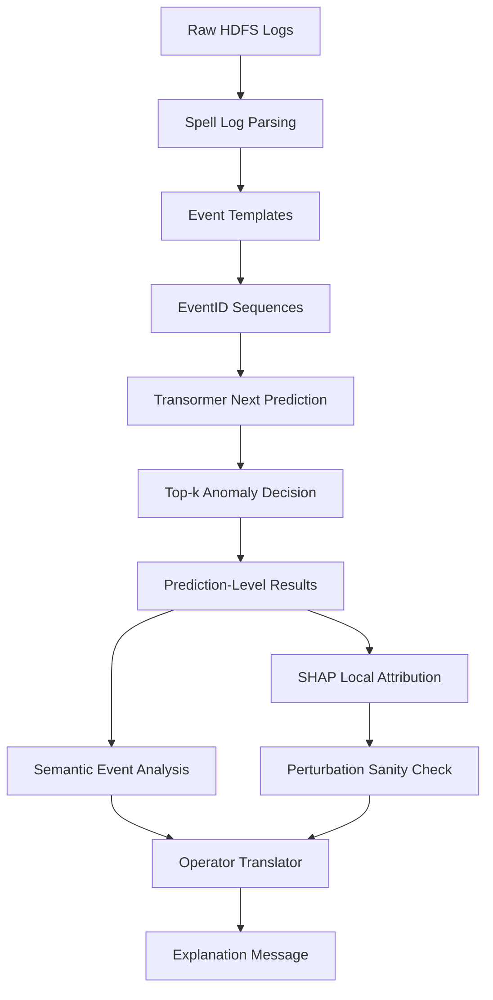
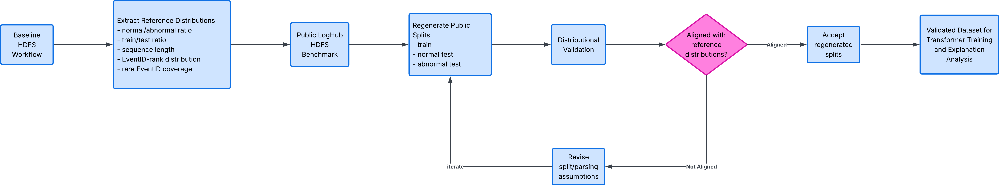
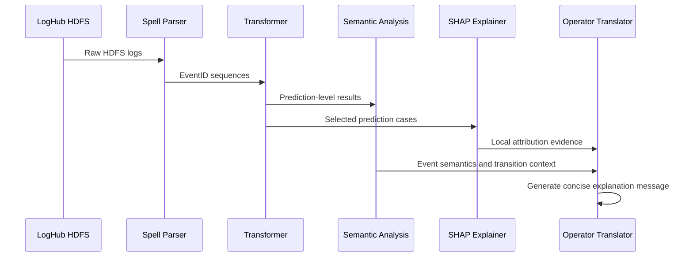

<h1 align="center">
  Towards an Explainable Transformer-Based Framework for HDFS Log Anomaly Detection
</h1>

<p align="center">
  <a href="https://github.com/arunbaruah/Anomaly_Detection_Transformer">Base Transformer implementation</a> ·
  <a href="https://github.com/logpai/loghub/tree/master">Loghub Datasets</a>
  <a href="./docs/getting-started.md">Getting started</a>
</p>

<p align="center">
  
  
  
  
</p>

---

## Overview

The project investigates how an existing Transformer-based HDFS anomaly detector can be explained using a layered workflow grounded in both **model behaviour** and **HDFS event semantics**.

This work does **not** propose a new Transformer architecture. Instead, it builds an explainability workflow around an existing Transformer-based next-event prediction model.

---

## Why This Project?

Control rooms and operational monitoring environments often face alarm floods, event overload, and time-pressure decision making. In these settings, a binary anomaly label is often not enough.

Operators and analysts need to understand:

- what event was flagged,
- why the model considered it unusual,
- whether the event pattern is unseen or rare,
- how the event relates to normal operational sequences, and
- what should be checked next.

This project uses the public **LogHub HDFS benchmark** as a reproducible proxy for sequence-based operational event analysis.

---

## Research Workflow



---

## Public Data Regeneration Workflow

The project replaces the private baseline HDFS workflow with a reproducible public-data workflow based on the **LogHub HDFS benchmark**. The regenerated train, normal-test, and abnormal-test splits are accepted only after distributional validation against the reference workflow.

<p align="center">
  
</p>

<p align="center">
  <i>Figure: Public-data regeneration workflow for validated Transformer training and explanation analysis.</i>
</p>

---

## Key Features

- **Transformer-based anomaly detection**
  - next-event prediction over HDFS EventID sequences
  - top-k anomaly decision rule

- **Public-data regeneration**
  - reproducible workflow using public LogHub HDFS data
  - distributional validation against the baseline workflow

- **BOS token correction**
  - separates the beginning-of-sequence token from valid HDFS EventIDs
  - improves representation clarity for explanation

- **Semantic event analysis**
  - unseen EventID analysis
  - top-k hit rate comparison
  - confidence and rank analysis
  - start/end event interpretation
  - latency and transition-pattern analysis

- **SHAP-based local explanation**
  - explains selected Transformer next-event predictions
  - interprets source-window positions as local explanatory features

- **Perturbation sanity check**
  - compares high-SHAP perturbation against random perturbation
  - checks whether attribution positions meaningfully affect model scores

- **Operator-oriented explanation translator**
  - converts model and semantic evidence into concise explanation messages
  - includes status, severity, evidence, transition context, and suggested checks

---

## Methodology

<details>
<summary><b>1. Public Data Regeneration</b></summary>

The original baseline workflow used private data. This repository regenerates the workflow using the public **LogHub HDFS** benchmark.

The regenerated data are validated using:

- sequence-length distribution,
- EventID-rank distribution,
- train/test split ratio,
- rare EventID coverage, and
- normal/abnormal label distribution.

</details>

<details>
<summary><b>2. Transformer Baseline</b></summary>

The model follows a next-event prediction approach.

Raw HDFS logs are parsed into event templates and converted into EventID sequences. The Transformer is trained on normal sequences. During inference, a sequence is treated as anomalous when the true next EventID is outside the model’s top-k predicted candidates.

</details>

<details>
<summary><b>3. BOS Token Correction</b></summary>

The baseline implementation used:

```text
BOS = 1
```

However, `1` is also a valid HDFS EventID. This creates ambiguity because one token can represent both a structural beginning-of-sequence marker and a real HDFS event.

The revised implementation assigns BOS outside the valid EventID range:

```text
BOS = max_event_id + 1
```

This correction is treated as an explainability-oriented design correction, not a performance optimisation.

</details>

<details>
<summary><b>4. Semantic Analysis</b></summary>

Semantic analysis is used to interpret model behaviour beyond aggregate metrics.

The analysis compares normal and abnormal traces using:

- unseen EventIDs,
- top-k hit rate,
- true EventID rank,
- model confidence,
- start events,
- ending events,
- latency, and
- transition patterns.

</details>

<details>
<summary><b>5. SHAP Explanation</b></summary>

SHAP is used as a local explanation method for selected next-event predictions.

In this project, the interpretable features are source-window positions in the HDFS EventID sequence.

SHAP is treated as supporting local evidence, not as a complete mechanistic explanation of the Transformer.

</details>

<details>
<summary><b>6. Perturbation Sanity Check</b></summary>

A lightweight sanity check compares:

- perturbing high-SHAP source positions, and
- perturbing random source positions.

If perturbing high-SHAP positions changes the model score more than random perturbation, the attribution is considered more behaviourally meaningful.

</details>

<details>
<summary><b>7. Operator-Oriented Translation</b></summary>

The translator converts technical evidence into concise messages containing:

- predicted status,
- severity,
- actual EventID,
- top-k result,
- probability or confidence,
- unseen-event status,
- transition context, and
- suggested operator check.

This translator is a proof-of-concept explanation layer and has not yet been validated with real operators.

</details>

---

## Main Findings

| Finding | Interpretation |
|---|---|
| BOS correction removed token ambiguity | Cleaner representation for explanation, but not a performance improvement. |
| Abnormal traces had more unseen EventIDs | Abnormal behaviour often includes events outside the normal training reference. |
| Abnormal traces had lower top-k hit rate | The model was less able to predict abnormal next events. |
| Semantic analysis gave strong explanation value | Event transitions and endings helped explain abnormality. |
| SHAP provided useful local evidence | Attribution helped explain selected prediction cases. |
| Sanity checks reduced overclaiming | Attribution was tested against model behaviour. |
| Translator improved readability | Technical signals were converted into concise explanation messages. |

---

## Example Operator-Oriented Explanation

```text
Status: Medium anomaly

Evidence:
Actual EventID E7 was outside the top-k candidate set.
The transition E5 → E7 was unseen or rare in normal training.

Explanation:
Unexpected write-failure behaviour occurred after a data-transfer event.
The sequence should be reviewed because the event order is not typical
of the normal training reference.

Suggested check:
Review the log context around E5 → E7 and check whether the write
interruption is expected for the current HDFS block operation.
```

---

## Repository Structure

```text
.
├── docs/
│   ├── research-overview.md
│   └── getting-started.md
│
├── notebooks/
│   ├── 00_exploration.ipynb
│   ├── 00_results_database.ipynb
│   ├── 01_detection_parse_data.ipynb
│   ├── 02_semantic_analysis.ipynb
│   ├── 03_xai_shap.ipynb
│   ├── 04_translator.ipynb
│   ├── Transformer.py
│   ├── Transformer_original.py
│   ├── shap_workflow.py
│   ├── translate_hdfs.py
│   └── translate_hdfs_predictions.py
│
├── pics/
│   └── data_regeneration_workflow.png
│
├── environment.yml
└── README.md
```

---

## Getting Started

### 1. Clone the repository

```bash
git clone https://github.com/miqbal-id27/controlroom-xai-alarm-support-transformer.git
cd controlroom-xai-alarm-support-transformer
```

### 2. Create the environment

```bash
conda env create -f environment.yml
conda activate cr-xai
```

### 3. Run the workflow

Recommended notebook order:

```text
notebooks/00_exploration.ipynb
notebooks/01_detection_parse_data.ipynb
notebooks/00_results_database.ipynb
notebooks/02_semantic_analysis.ipynb
notebooks/03_xai_shap.ipynb
notebooks/04_translator.ipynb
```

---

## Research Pipeline



---

## Important Limitations

This repository is a research prototype.

- HDFS is used as a benchmark proxy and does not fully represent real SCADA, industrial alarm, or control-room data.
- The regenerated public workflow is distributionally validated, not proven identical to the original private baseline data.
- SHAP is applied to selected cases and should be interpreted as local explanation evidence.
- The operator-oriented translator has not yet been evaluated with real operators.
- This project should not be treated as an operationally validated decision-support system.

---

## Future Work

- Expand SHAP and perturbation analysis across more prediction cases.
- Calibrate the top-k anomaly decision rule to reduce false positives.
- Evaluate explanation messages with operators or domain experts.
- Apply the workflow to real operational logs closer to control-room alarm data.
- Develop an interactive dashboard for anomaly status, semantic evidence, SHAP results, and suggested checks.

---

## Citation

If you use this repository, please cite:

```bibtex
@misc{iqbal2026hdfs-transformer,
  title  = {Towards an Explainable Transformer-Based Framework for HDFS Log Anomaly Detection},
  author = {Iqbal, Muhammad},
  year   = {2026},
  note   = {Monash University Minor Thesis}
}
```

---

## Acknowledgement

This project builds on the Transformer-based log anomaly detection implementation by Arun Baruah and uses the public LogHub HDFS benchmark.

The research was conducted as part of a Monash University project on explainable anomaly detection and operator-oriented decision support.

---

<p align="center">
  <b>Layered XAI = Semantic Analysis + SHAP Attribution + Sanity Check + Operator-Oriented Translation</b>
</p>
